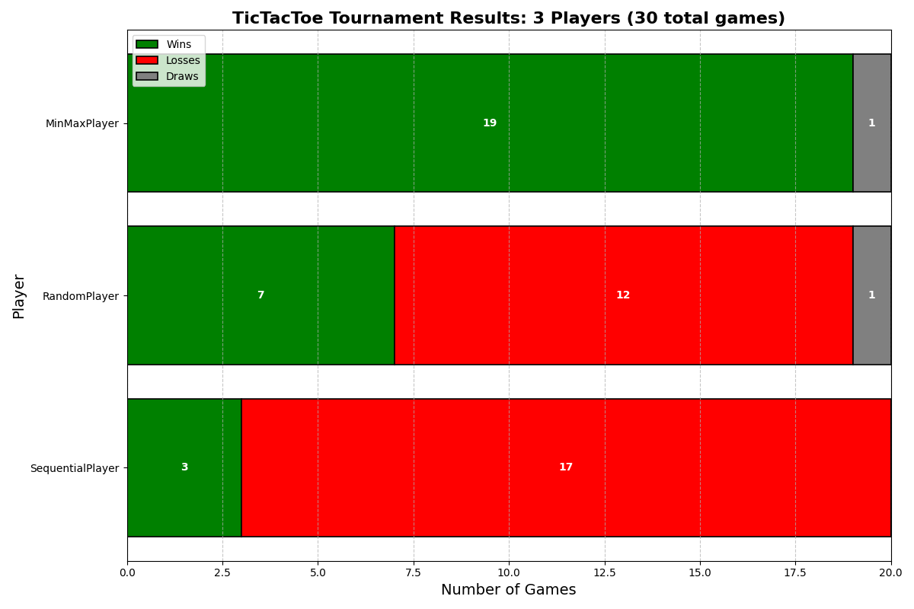

# Board

A lightweight platform for running automated players against each other in board games so you can compare strategies and evaluate performance.

---

## What this repo includes

- A tournament engine that runs round-robin matches between players.
- A game framework that allows plugging in new games + players.
- Tic Tac Toe implementation with three built-in players:
  - `RandomPlayer` (random valid moves)
  - `SequentialPlayer` (first-available move)
  - `MinMaxPlayer` (perfect-play minimax algorithm)
- A results plot generator (uses `matplotlib`) and an example screenshot is included below.

---

## Screenshot



---

## How to run

> This project is written in Python and requires `matplotlib`.

### 1) Install dependencies

```bash
python -m pip install matplotlib
```

### 2) Run a tournament (from the repo root)

```bash
python src/main.py --game tic_tac_toe
```

#### Optional flags

- `--num_games`: Number of games each pairing plays (default: `10`)
- `--threads`: Number of parallel worker threads (default: `1`)

Example:

```bash
python src/main.py --game tic_tac_toe --num_games 50 --threads 3
```

---

## What this repo is for

This repository is meant as a platform for comparing automated game-playing strategies. It is designed so that:

- You can add new games (e.g., Connect Four, Checkers)
- You can add new players/agents (e.g., Monte Carlo Tree Search, neural networks)
- You can run tournaments and compare win rates / stats

---

## Future work

- Improved tournament system (better score tracking, configurable formats)
- Additional games beyond Tic Tac Toe
- More advanced player agents (MCTS, reinforcement learning, etc.)

---

## Outputs

- `logs/game_results.log`: tournament logs
- `logs/tournament_results.png`: generated results plot

---
